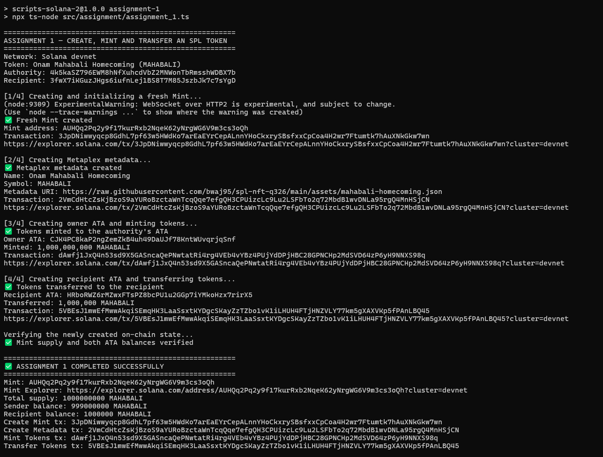
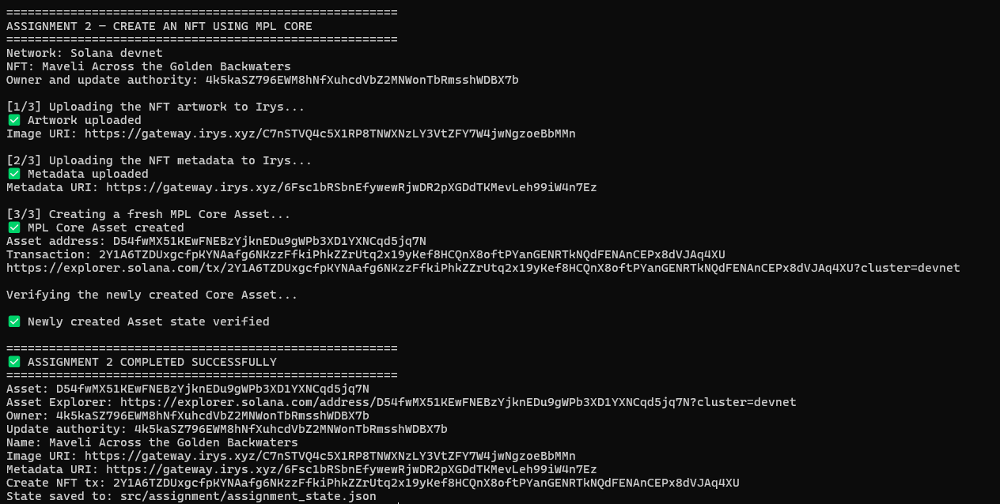
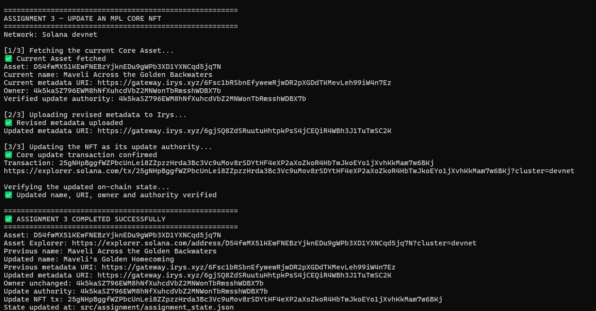

# 🌼 Onam Mahabali Homecoming — SPL Token

> **ഓണാശംസകൾ! Onashamsakal!** King Mahabali has arrived on Solana devnet. 👑


# Turbin3 Week 1 — SPL Token and MPL Core NFT

This repository contains my Week 1 assignment for the **Turbin3 Q3 Builders Cohort**. Each assignment is implemented as a standalone TypeScript integration script that creates or updates fresh state on **Solana devnet**, confirms every transaction, fetches the resulting accounts, and asserts the expected state.

The assets use an Onam theme: the fungible token represents King Mahabali's homecoming, while the NFT depicts Maveli crossing Kerala's golden backwaters.

## Assignment status

| Task | Status | Command |
|---|---|---|
| 1. Mint and transfer a custom SPL token | ✅ Completed | `npm run assignment-1` |
| 2. Mint an NFT using MPL Core | ✅ Completed | `npm run assignment-2` |
| 3. Update the NFT's name and metadata as update authority | ✅ Completed | `npm run assignment-3` |

## Execution evidence

Each command performs real devnet transactions and finishes only after its newly created or updated state passes all assertions.

### Assignment 1 — SPL token



### Assignment 2 — MPL Core NFT



### Assignment 3 — NFT update



## Assignment 1: mint and transfer an SPL token

`assignment_1.ts` executes the complete token flow in one run:

1. Creates and initializes a fresh SPL Mint with six decimals.
2. Creates a Metaplex Token Metadata PDA for the Mint.
3. Creates the authority's Associated Token Account.
4. Mints `1,000,000,000 MAHABALI` into that ATA.
5. Creates the recipient's ATA and transfers `1,000,000 MAHABALI`.
6. Fetches the new Mint and both ATAs and asserts the supply and balances.

### Token accounts

| Field | Value |
|---|---|
| Token name | Onam Mahabali Homecoming |
| Symbol | `MAHABALI` |
| Mint | [`AUHQq2Pq2y9f17kurRxb2NqeK62yNrgWG6V9m3cs3oQh`](https://explorer.solana.com/address/AUHQq2Pq2y9f17kurRxb2NqeK62yNrgWG6V9m3cs3oQh?cluster=devnet) |
| Decimals | `6` |
| Minted supply | `1,000,000,000 MAHABALI` |
| Authority | `4k5kaSZ796EWM8hNfXuhcdVbZ2MNWonTbRmsshWDBX7b` |
| Authority ATA | [`CJK4PC8kaP2ngZemZkB4uh49DaUJf78KntWUvqrjqSnf`](https://explorer.solana.com/address/CJK4PC8kaP2ngZemZkB4uh49DaUJf78KntWUvqrjqSnf?cluster=devnet) |
| Recipient | `3fwX7iKGuzJHgs6iufnLej1BS8T7M85JszbJk7c7sYgD` |
| Recipient ATA | [`HRboRWZ6rMZwxFTsPZ8bcPU1u2GGp7iYMkoHzx7rirX5`](https://explorer.solana.com/address/HRboRWZ6rMZwxFTsPZ8bcPU1u2GGp7iYMkoHzx7rirX5?cluster=devnet) |
| Final authority balance | `999,000,000 MAHABALI` |
| Final recipient balance | `1,000,000 MAHABALI` |

### Token transactions

| Operation | Devnet transaction |
|---|---|
| Create and initialize Mint | [`3JpDNiww...Gkw7wn`](https://explorer.solana.com/tx/3JpDNiwwyqcp8GdhL7pf63w5HWdKo7arEaEYrCepALnnYHoCkxrySBsfxxCpCoa4H2wr7Ftumtk7hAuXNkGkw7wn?cluster=devnet) |
| Create Metaplex metadata | [`2VmCdHtc...MnHSjCN`](https://explorer.solana.com/tx/2VmCdHtcZsKjBzoS9aYURoBzctaWnTcqQqe7efgQH3CPUizcLc9Lu2LSFbTo2q72MbdB1wvDNLa95rgQ4MnHSjCN?cluster=devnet) |
| Create authority ATA and mint supply | [`dAwfj1Jx...NNXS98q`](https://explorer.solana.com/tx/dAwfj1JxQ4n53sd9X5GASncaQePNwtatRi4rg4VEb4vYBz4PUjYdDPjHBC28GPNCHp2MdSVD64zP6yH9NNXS98q?cluster=devnet) |
| Create recipient ATA and transfer | [`5VBEsJ1m...PAnLBQ45`](https://explorer.solana.com/tx/5VBEsJ1mwEfMwwAkqiSEmqHK3LaaSsxtKYDgcSKayZzTZbo1vK1iLHUH4FTjHNZVLY77km5gXAXVKp5fPAnLBQ45?cluster=devnet) |

The verification step asserts:

```text
Mint supply       = 1,000,000,000 MAHABALI
Authority balance =   999,000,000 MAHABALI
Recipient balance =     1,000,000 MAHABALI
```

## Assignment 2: create an NFT using MPL Core

`assignment_2.ts` performs the complete Core creation flow:

1. Uploads the PNG artwork to Irys.
2. Uploads a new JSON metadata document referencing the artwork.
3. Generates a new Core Asset signer and creates the Asset on devnet.
4. Fetches the newly created Asset and asserts its name, URI, owner, and update authority.
5. Saves its public data to `assignment_state.json` for Assignment 3.

### Created Core Asset

| Field | Value |
|---|---|
| Asset | [`D54fwMX51KEwFNEBzYjknEDu9gWPb3XD1YXNCqd5jq7N`](https://explorer.solana.com/address/D54fwMX51KEwFNEBzYjknEDu9gWPb3XD1YXNCqd5jq7N?cluster=devnet) |
| Original name | Maveli Across the Golden Backwaters |
| Owner | `4k5kaSZ796EWM8hNfXuhcdVbZ2MNWonTbRmsshWDBX7b` |
| Update authority | `4k5kaSZ796EWM8hNfXuhcdVbZ2MNWonTbRmsshWDBX7b` |
| Image | [View original artwork](https://gateway.irys.xyz/C7nSTVQ4c5X1RP8TNWXNzLY3VtZFY7W4jwNgzoeBbMMn) |
| Original metadata | [View original JSON](https://gateway.irys.xyz/6Fsc1bRSbnEfywewRjwDR2pXGDdTKMevLeh99iW4n7Ez) |
| Create transaction | [`2Y1A6TZD...VJAq4XU`](https://explorer.solana.com/tx/2Y1A6TZDUxgcfpKYNAafg6NKzzFfkiPhkZZrUtq2x19yKef8HCQnX8oftPYanGENRTkNQdFENAnCEPx8dVJAq4XU?cluster=devnet) |

MPL Core represents the NFT with a single Asset account. The account stores the asset's owner, update authority, name, and metadata URI; it does not require an SPL Mint, ATA, or separate Token Metadata PDA.

## Assignment 3: update the NFT

`assignment_3.ts` reads the Asset produced by Assignment 2 and:

1. Fetches its current on-chain state.
2. Verifies that the connected wallet matches its update authority.
3. Uploads revised JSON metadata to a new Irys URI.
4. Calls the MPL Core `update` instruction with a new name and URI.
5. Fetches the Asset again and asserts the update while confirming that its address, owner, and update authority remain unchanged.

### Update result

| Field | Before | After |
|---|---|---|
| Asset address | `D54fwMX5...NCqd5jq7N` | Unchanged |
| Owner | `4k5kaSZ7...sshWDBX7b` | Unchanged |
| Update authority | `4k5kaSZ7...sshWDBX7b` | Unchanged |
| Name | Maveli Across the Golden Backwaters | Maveli's Golden Homecoming |
| Metadata URI | [Original JSON](https://gateway.irys.xyz/6Fsc1bRSbnEfywewRjwDR2pXGDdTKMevLeh99iW4n7Ez) | [Updated JSON](https://gateway.irys.xyz/6gjSQ8ZdSRuutuHhtpkPsS4jCEQiR4WBh3J1TuTmSC2K) |

**Update transaction:** [`25gNHpBg...am7w6BKj`](https://explorer.solana.com/tx/25gNHpBggfWZPbcUnLei8ZZpzzHrda3Bc3Vc9uMov8rSDYtHF4eXP2aXoZkoR4HbTwJkoEYo1jXvhKkMam7w6BKj?cluster=devnet)

The original off-chain JSON remains available at its original content-addressed URI. The Core update transaction creates the on-chain evidence connecting the unchanged Asset address to the revised name and new metadata URI.

## Running the assignments

### Prerequisites

- Node.js 20+
- A funded Solana devnet wallet
- The wallet stored locally as `devnet-wallet.json`

The wallet file contains private-key material and is excluded by `.gitignore`.

Install dependencies:

```bash
npm install
```

Run each assignment in order:

```bash
npm run assignment-1
npm run assignment-2
npm run assignment-3
```

Run the complete end-to-end sequence with:

```bash
npm test
```

Assignments 1 and 2 create fresh on-chain accounts every time they run and consume devnet SOL for rent and transaction fees. Assignment 3 depends on the `assignment_state.json` generated by the latest successful Assignment 2 run. Therefore, `npm test` also creates a new Mint and Core Asset rather than replaying the addresses documented above.

If the public devnet RPC is rate-limited, an alternative endpoint can be supplied:

```bash
SOLANA_RPC_URL="https://your-devnet-rpc.example" npm run assignment-1
```

## Project structure

```text
assets/
└── maveli-golden-backwaters.png

src/
├── assignment/
│   ├── assignment_1.ts
│   ├── assignment_2.ts
│   ├── assignment_3.ts
│   └── assignment_state.json
├── nft/
│   ├── nft_image.ts
│   ├── nft_metadata.ts
│   └── nft_mint.ts
└── spl/
    ├── spl_init.ts
    ├── spl_metadata.ts
    ├── spl_mint.ts
    └── spl_transfer.ts
```

## Technologies

- TypeScript
- Solana Kit
- SPL Token Program
- Metaplex Token Metadata
- Metaplex Core
- Umi
- Irys

---

Built for the Turbin3 Q3 Builders Cohort on Solana devnet.
